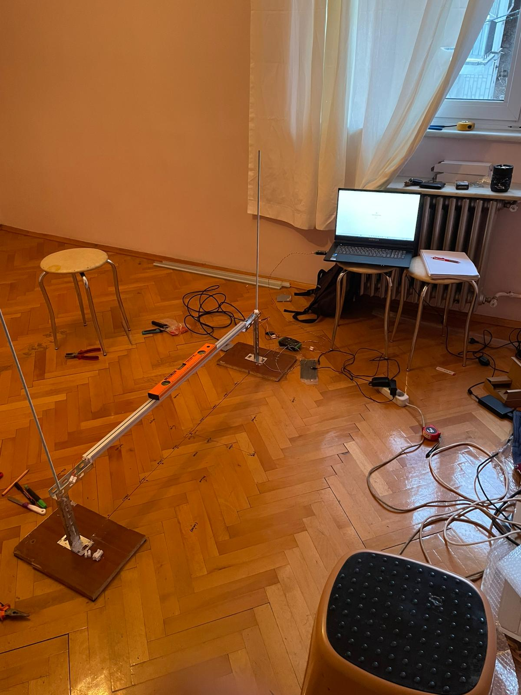
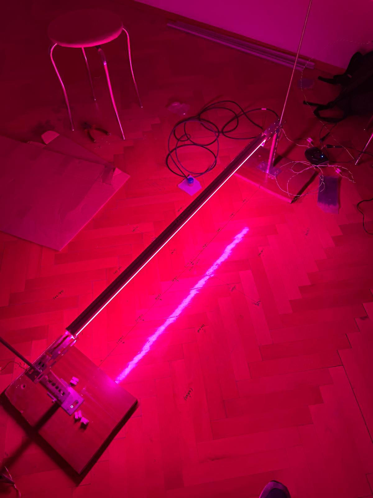
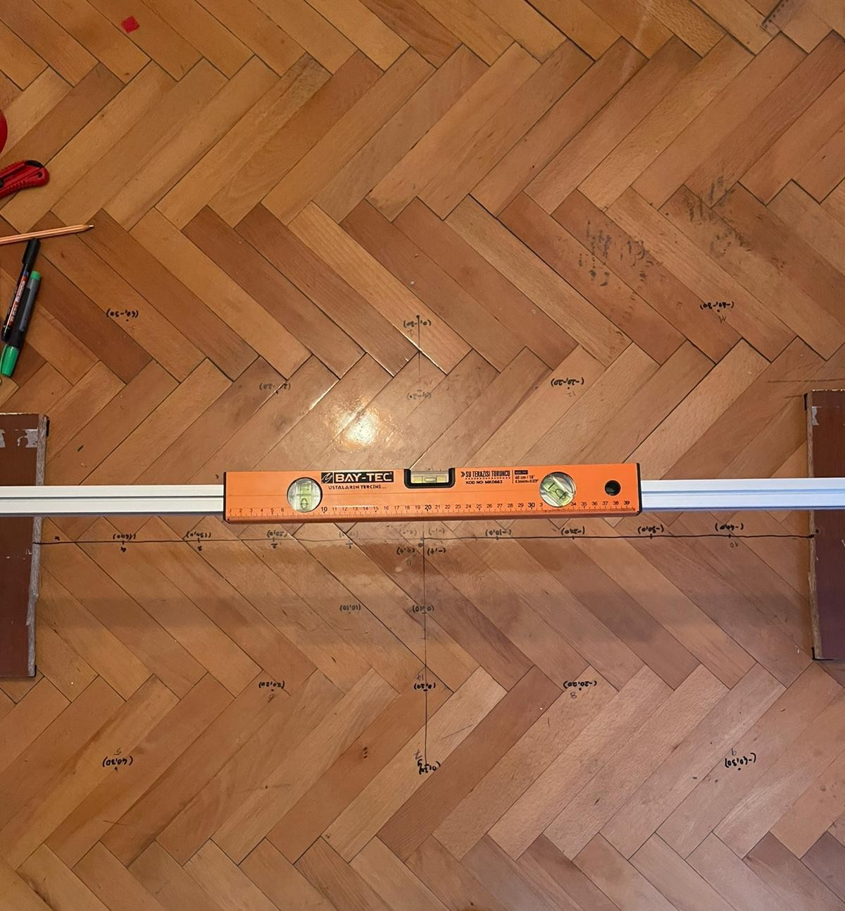
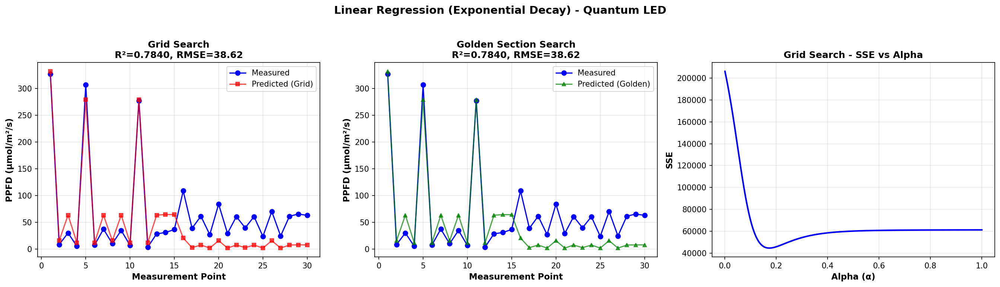
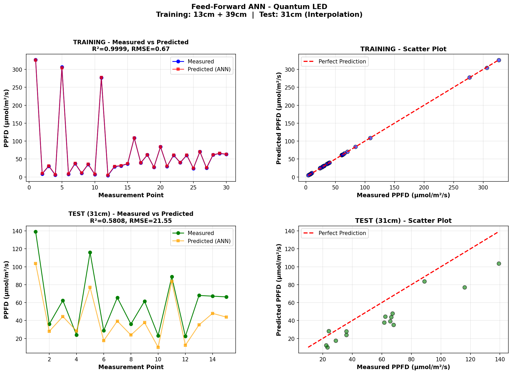
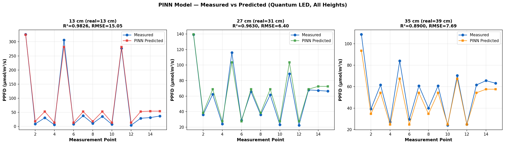
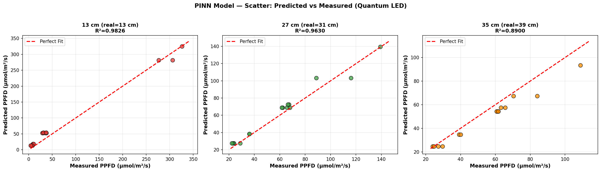

# LED PPFD Işık Dağılımı Tahmin Sistemi

**Lineer Regresyon · YSA (ANN) · PINN — Karşılaştırmalı Analiz**

> Tarımsal LED aydınlatma için **PPFD** (*Photosynthetic Photon Flux Density*) değerlerini
> farklı yükseklik ve konumlarda tahmin eden, üç farklı ML yaklaşımını karşılaştıran
> interaktif bir analiz ve simülasyon sistemi.
>
> Veri seti, **Quantum PAR sensörü** ile deneysel olarak tarafımdan toplanmıştır.

---

## Demo


> Video çalışmıyorsa: [video_materials/light_short.mp4](video_materials/light_short.mp4)

---

## Deneysel Kurulum / Experimental Setup

Veriler, gerçek bir dikey tarım aydınlatma düzeneğinde **Apogee Instruments Quantum PAR sensörü**
ile tarafımdan toplanmıştır. Her yükseklikte 15 farklı ölçüm noktasında ölçüm yapılmıştır.

| | |
|:---:|:---:|
|  |  |
| *Genel kurulum görünümü* | *Quantum LED (mor spektrum)* |
|  |  |
| *15 ölçüm noktası yerleşimi* | *Sensör ve ölçüm kurulumu* |

---

## İçindekiler

- [Problem ve Motivasyon](#problem-ve-motivasyon)
- [Veri Seti](#veri-seti)
- [Model 1: Lineer Regresyon](#model-1-lineer-regresyon-üstel-bozunma)
- [Model 2: Yapay Sinir Ağı (YSA)](#model-2-yapay-sinir-ağı-ysa)
- [Model 3: PINN](#model-3-pinn--physics-informed-neural-network)
- [Model Karşılaştırması](#model-karşılaştırması)
- [GUI Arayüzü](#gui-arayüzü)
- [Kullanım](#kullanım)
- [Dosya Yapısı](#dosya-yapısı)

---

## Problem ve Motivasyon

Tarımsal aydınlatmada LED panellerin kurulumu için en kritik parametre, belirli bir yükseklik
ve konumda oluşan PPFD değeridir.

| Parametre | Hedef Değer |
|-----------|-------------|
| Optimal PPFD | 160 – 320 µmol/m²/s |
| DLI (Daily Light Integral) | ~11.5 mol/m²/gün |
| Fotoperiod | 8 – 20 saat |

**Sorunlar:**
- Her konuma PAR sensörü yerleştirmek pahalı ve zaman alıcı
- LED tipi, yükseklik ve konuma göre dağılım büyük ölçüde değişiyor
- Teorik hesaplamalar gerçek dağılımı tam yakalayamıyor

**Çözüm:** Gerçek ölçümlerle eğitilen ML modelleri

---

## Veri Seti

### LED Tipleri

| LED Tipi | LED Sayısı | Uzunluk | Maliyet |
|----------|-----------|---------|---------|
| **Quantum** | 120 | 100 cm | 2.200 USD |
| **12V** | 144 | 100 cm | 550 USD |
| **54V** | 72 | 100 cm | 850 USD |

### Ölçüm Konfigürasyonu

- **15 ölçüm noktası** — X: [-40, +40] cm, Y: [-30, +30] cm, merkez: (0, 0)
- **3 nominal yükseklik:** 13 cm, 27 cm, 35 cm

```
Quantum LED — Yükseklik Offseti:
  13 cm nominal  →  13 cm gerçek
  27 cm nominal  →  31 cm gerçek (+4 cm offset)
  35 cm nominal  →  39 cm gerçek (+4 cm offset)
```

- **PPFD dönüşümü:** Ham ölçüm × 0.8 = gerçek PPFD
- **PPFD aralığı:** 4 – 326.4 µmol/m²/s

> Veri, **Apogee Instruments Quantum PAR sensörü** ile tarafımdan deneysel olarak
> toplanmıştır. Her yükseklik–konum kombinasyonu için tekrarlı ölçüm yapılmıştır.

---

## Model 1: Lineer Regresyon (Üstel Bozunma)

### Fiziksel Model

```
PPFD(x, y, h) = θ₁ × Σᵢ exp(−α × Rᵢ)

Rᵢ = √[(x−xᵢ)² + (y−yᵢ)² + h²]
```

| Parametre | Anlam |
|-----------|-------|
| **θ₁** | PPFD amplitüdü — LED başına ışık çıkışı |
| **α** | Üstel bozunma katsayısı |
| **Rᵢ** | i. LED'den ölçüm noktasına 3D Öklid mesafesi |

### Optimizasyon

θ₁ için analitik kapalı form çözüm kullanılır:
```
θ₁_opt = (S · PPFD_measured) / (S · S)
```

İki farklı α araması:
- **Grid Search** — [0.001, 1.0] aralığında 500 eşit aralıklı nokta
- **Golden Section Search** — Scipy `minimize_scalar`, tolerans: 1×10⁻¹²

### Sonuçlar

| Yöntem | α | θ₁ | R² | RMSE |
|--------|---|-----|-----|------|
| Grid Search | 0.1732 | 106.10 | 0.784 | 38.62 µmol/m²/s |
| Golden Section | 0.1734 | 106.56 | 0.784 | 38.62 µmol/m²/s |


*Grid Search ve Golden Section karşılaştırması — Ölçülen vs Tahmin + SSE vs Alpha eğrisi*

**Değerlendirme:**
- ✅ Yorumlanabilir fiziksel parametreler (α, θ₁)
- ✅ Hızlı hesaplama, matematiksel şeffaflık
- ❌ Tek α değeri tüm yüksekliklerde yetersiz kalıyor (R²=0.78)

---

## Model 2: Yapay Sinir Ağı (YSA)

### Mimari

```
Giriş [x, y, h]
      ↓
  Dense(64, ReLU)
      ↓
  Dense(32, ReLU)
      ↓
  Dense(16, ReLU)
      ↓
  Dense(1, Linear)   →  PPFD tahmini
```

### Eğitim

| Parametre | Değer |
|-----------|-------|
| Optimizer | Adam |
| Loss | MSE |
| Epoch | 1000 |
| Batch size | 4 |
| Normalizasyon | StandardScaler (X ve y ayrı) |

### Veri Bölünmesi

| Küme | Yükseklikler | Nokta sayısı | Amaç |
|------|-------------|--------------|------|
| Eğitim | 13 cm + 39 cm | 30 | Model öğrenmesi |
| Test | 31 cm | 15 | **İnterpolasyon testi** |

### Sonuçlar

| Küme | R² | RMSE |
|------|----|------|
| Eğitim (13+39 cm) | **0.9999** | 0.67 µmol/m²/s |
| Test (31 cm) | 0.5808 | 21.55 µmol/m²/s |


*Üst satır: Eğitim seti (13+39 cm) — Alt satır: Test seti (31 cm, interpolasyon)*

**Değerlendirme:**
- ✅ Eğitim verisinde mükemmel uyum (R²≈1.0)
- ✅ Herhangi koordinat ve LED tipi için kullanılabilir
- ❌ **Overfitting** — eğitim/test R² farkı büyük (0.9999 vs 0.58)
- ❌ Fiziksel yorum yok (kara kutu modeli)

---

## Model 3: PINN — Physics-Informed Neural Network

### Neden PINN?

| Sorun | PINN Çözümü |
|-------|-------------|
| Lineer Reg → düşük R² (0.78) | FFNN ile yüksekliğe bağlı A(h) öğrenir |
| YSA → overfitting | Fizik denklemi kısıt olarak ekleniyor |
| Az veri | Fiziksel denklem eksik veriyi telafi eder |

### Model Mimarisi

```
h (yükseklik)
      ↓
  FFNN: h → A(h)        [64 → 32 → 8 → 1 nöron]
      ↓
  Fizik Katmanı:
  PPFD = A(h) × Σᵢ [ h / Rᵢ³ × exp(−α × Rᵢ) ]
      ↓
  PPFD tahmini
```

| Bileşen | Açıklama |
|---------|----------|
| **A(h)** | Yüksekliğe bağlı amplitüd — FFNN tarafından öğrenilir |
| **α** | Global bozunma katsayısı — öğrenilen parametre |
| **LED konumları** | Modele **dışarıdan** verilir — ağırlıklara gömülü değil! |

> **Temel Yenilik:** LED konumları model ağırlıklarına gömülü değil.
> Bu sayede model; farklı LED orientasyonları, çoklu lamba kurulumları
> ve farklı LED sayıları ile yeniden kullanılabilir.

### Eğitim

| Parametre | Değer |
|-----------|-------|
| Learning rate | 0.0005 |
| Epoch | 5000 |
| Batch size | 4 |
| Eğitim verisi | 13 cm + 27 cm + 35 cm (tüm yükseklikler) |

### Sonuçlar

**Quantum LED — Tüm Yüksekliklerde:**

| Yükseklik | R² | RMSE |
|-----------|----|------|
| 13 cm (real: 13 cm) | **0.9826** | 15.05 µmol/m²/s |
| 27 cm (real: 31 cm) | **0.9630** | 6.40 µmol/m²/s |
| 35 cm (real: 39 cm) | **0.8900** | 7.69 µmol/m²/s |


*PINN — Ölçülen vs Tahmin edilen PPFD (tüm 3 yükseklik)*


*PINN Scatter grafikleri — Tahmin edilen vs Ölçülen PPFD*

**Kaydedilen Modeller (Tüm LED Tipleri):**

| LED | R² | RMSE |
|-----|----|------|
| Quantum | 0.9781 | 10.44 µmol/m²/s |
| 12V | 0.9546 | 4.01 µmol/m²/s |
| 54V | 0.9793 | 6.53 µmol/m²/s |

**Öğrenilen parametre:** Quantum LED için α = 0.0428 cm⁻¹

**Değerlendirme:**
- ✅ Yüksek R² tüm yüksekliklerde
- ✅ Fiziksel parametreler yorumlanabilir
- ✅ Farklı LED konfigürasyonlarına genelleştirilebilir
- ✅ Az veriyle iyi performans (fizik denklemi kısıt sağlıyor)

---

## Model Karşılaştırması

| Model | R² (Eğitim) | R² (Test) | RMSE | Fizik | Yorumlanabilirlik |
|-------|-------------|-----------|------|-------|-------------------|
| **Lineer Regresyon** | 0.784 | 0.784 | 38.62 | ✅ | ✅ Yüksek |
| **YSA (ANN)** | 0.9999 | 0.580 | 0.67 | ❌ | ❌ Kara kutu |
| **PINN** | **0.978** | — | **10.44** | ✅ | ✅ Yüksek |

**Sonuç:**
- 🥇 **PINN** — en iyi denge: fizik + veri uyumu + genelleştirilebilirlik
- 🔍 **Lineer Regresyon** — en yorumlanabilir, fiziksel anlayış için değerli
- ⚠️ **YSA** — overfitting sorunu; daha fazla veri ile iyileştirilebilir

---

## GUI Arayüzü

Tkinter tabanlı interaktif masaüstü uygulaması — 5 sekme:

| Sekme | İçerik |
|-------|--------|
| **Görselleştirme** | PPFD ısı haritaları, tüm LED/yükseklik kombinasyonları |
| **Lineer Regresyon** | Parametre tahmini, SSE grafiği, interaktif hesaplayıcı |
| **YSA Tahmini** | Yapılandırılabilir mimari (1-5 kat, 4-256 nöron), gerçek zamanlı eğitim |
| **PINN Tahmini** | A(h) & α grafikleri, model kaydet/yükle, tahmin aracı |
| **Özel LED Düzeni** | Özel LED konfigürasyonu, çoklu lamba simülasyonu |

```bash
python new_led_visualization_gui.py
```

> GUI ekran görüntüleri yakında eklenecek.

---

## Kullanım

### Gereksinimler

```bash
pip install tensorflow numpy pandas matplotlib scikit-learn scipy h5py pillow python-docx
```

### Script Çalıştırma Sırası

```bash
# 1. Lineer Regresyon → results/linear_regression_results.png
python simple_quantum_estimation.py

# 2. ANN → results/ann_results.png
python simple_quantum_ann_estimation.py

# 3. Kaydedilmiş PINN modelinden grafik üret → results/pinn_*.png
python generate_pinn_results.py

# 4. PINN'i sıfırdan eğit (opsiyonel, ~5000 epoch)
python pinn_quantum_estimation.py

# 5. Word raporu oluştur
python create_report.py

# 6. GUI'yi başlat
python new_led_visualization_gui.py
```

---

## Dosya Yapısı

```
light_last/
│
├── new_led_visualization_gui.py          # Ana GUI (~4400 satır, 5 sekme)
├── simple_quantum_estimation.py          # Lineer Regresyon (Grid + Golden Section)
├── simple_quantum_ann_estimation.py      # Feed-Forward ANN
├── pinn_quantum_estimation.py            # PINN eğitim scripti (5000 epoch)
├── generate_pinn_results.py              # Kaydedilmiş PINN → grafik üretimi
├── ppfd_hour_for_given_dli.py            # DLI / fotoperiod hesaplayıcı
├── create_report.py                      # Word raporu oluşturma
├── LED_PPFD_Project_Report.docx          # Türkçe proje raporu
├── README.md
├── DEVELOPMENT_NOTES.md
│
├── idx_to_points.csv                     # 15 ölçüm noktası (x, y koordinatları)
├── 13_cm_led_height_ppfd_values.csv      # PPFD ölçümleri — 13 cm
├── 27_cm_led_height_ppfd_values.csv      # PPFD ölçümleri — 27 cm
├── 35_cm_led_height_ppfd_values.csv      # PPFD ölçümleri — 35 cm
│
├── saved_models/
│   ├── pinn_model_Quantum.h5 + _metadata.json
│   ├── pinn_model_12V.h5     + _metadata.json
│   └── pinn_model_54V.h5     + _metadata.json
│
├── results/
│   ├── linear_regression_results.png
│   ├── ann_results.png
│   ├── pinn_measured_vs_predicted.png
│   └── pinn_scatter.png
│
└── video_materials/
    ├── light_short.mp4                   # Kısa demo videosu
    ├── sistem_uzak.jpeg                  # Genel kurulum görünümü
    ├── mor_kullan.jpeg                   # Quantum LED yakın çekim
    ├── duzlem_kullan.jpeg                # Ölçüm noktaları düzlemi
    └── sensor_yakın_kullan.jpeg          # PAR sensör yakın çekim
```

---

## Teknolojiler

| Paket | Kullanım |
|-------|----------|
| **TensorFlow / Keras** | YSA ve PINN modelleri |
| **NumPy** | Matris hesapları, mesafe matrisi |
| **Pandas** | CSV veri işleme |
| **Matplotlib** | Tüm grafikler ve ısı haritaları |
| **Scikit-learn** | StandardScaler normalizasyon |
| **SciPy** | Golden Section Search optimizasyonu |
| **Tkinter** | GUI arayüzü |
| **h5py** | Model ağırlıkları okuma/yazma |
| **python-docx** | Word raporu oluşturma |

---

*Veri Apogee Instruments Quantum PAR sensörü ile deneysel olarak tarafımdan toplanmıştır.*
*CV portföyü projesi — 2025*
